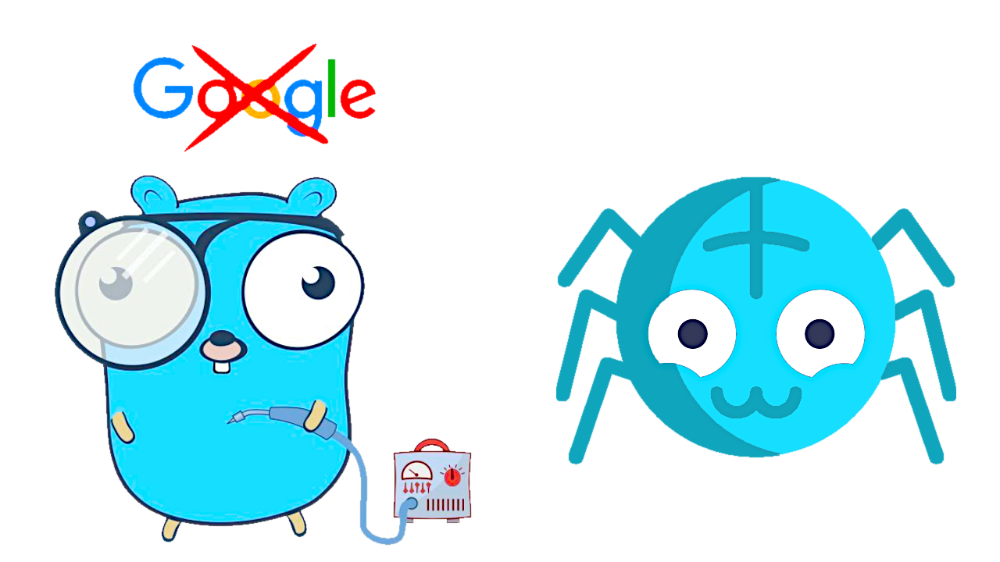
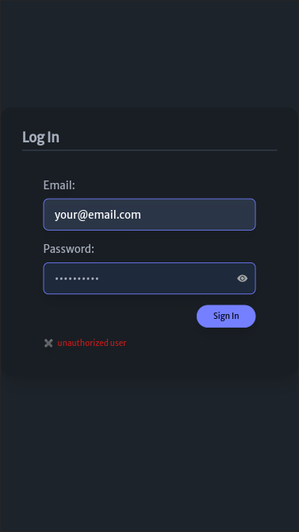
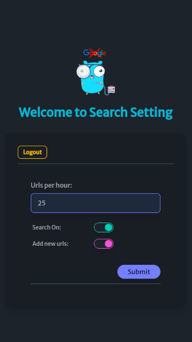

<div align="center">
  
<h1 align="center">Search Engine</h1>



<hr />

<p style="margin-bottom: 16px;">
    A mini Google. Custom web crawler & indexer written in Golang.
</p>

> 🚧 This is a work in progress and therefore you should expect that the
> application may not have all the features at this moment.

<br />
  
 

</div>

<hr />

## 🖼️ Screenshots:

<div align="center">

###### Admin login screen and dashboard:

&nbsp;&nbsp;

</div>

---

## 👨‍🚀 Installation and Usage

Before compiling the view templates, you'll need to regenerate the CSS. First, you need to install the dependencies required by `Tailwind CSS` and `daisyUI` (you must have `Node.js` installed on your system) and then run the regeneration of the `main.css` file. To do this, apply the following commands:

```
$ cd tailwind && npm i
$ npm run build-css-prod # `npm run watch-css` regenerate the css in watch mode for development
```

Since we use the PostgreSQL database from a Docker container, it is necessary to have the latter also installed and execute this command in the project folder:

```
$ docker compose up -d
```

These other commands will also be useful to manage the database from its container:

```
$ docker start search-engine # start container
$ docker stop search-engine # stop container
$ docker exec -it search-engine psql -U postgres # (user: postgres, without password)
```

Besides the obvious prerequisite of having Go! on your machine, you must have [Air](https://github.com/air-verse/air) installed for hot reloading when editing code.

>[!TIP]
>***In order to have autocompletion and syntax highlighting in VS Code for the `Templ templating language`, you will have to install the [templ-vscode](https://marketplace.visualstudio.com/items?itemName=a-h.templ) extension (for vim/nvim install this [plugin](https://github.com/joerdav/templ.vim)). To generate the Go code corresponding to these templates you will have to download this [executable binary](https://github.com/a-h/templ/releases/tag/v0.2.476) from Github and place it in the PATH of your system. The command:***

```
$ templ generate # `templ generate --watch` to enable watch mode
```

>[!TIP]
>***This command allows us to regenerate the `.templ` templates and, therefore, is necessary to start the application. This will also allow us to monitor changes to the `.templ` files (if we have the `--watch` flag activated) and compile them as we save them if we make changes to them. Review the documentation on Templ [installation](https://templ.guide/quick-start/installation) and [support](https://templ.guide/commands-and-tools/ide-support/) for your IDE .***

Build for production:

```
$ go build -ldflags="-s -w" -o ./bin/search-engine ./cmd/search-engine/main.go # ./bin/search-engine to run the application / Ctrl + C to stop the application
```

Start the app in development mode:

```
$ air # This compiles the view templates automatically / Ctrl + C to stop the application
```

---

### Happy coding 😀!!